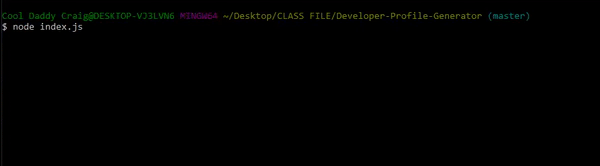

# Developer-Profile-Generator
Node.JS and ES6+

This application allows a user to create their own webpage as well as a PDF file of ones GitHub account. As seen in the animation below using the command terminal one will input their information as prompted and the application is then formed to the users personal preferences.

An example of the output is show below.

